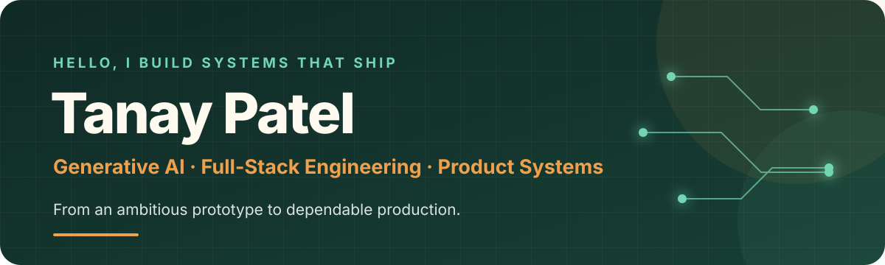
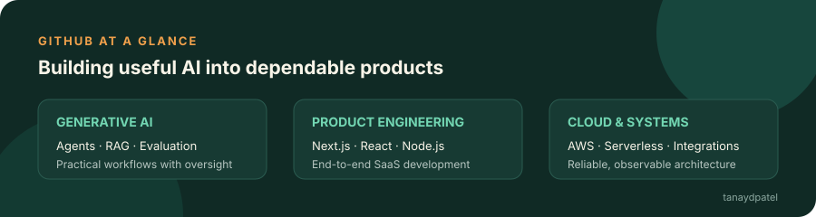

  

  
  
  
  

## Building useful AI into real products

I’m a **Generative AI & Full-Stack Engineer** who connects product thinking, software architecture, and hands-on implementation. I work across AI-assisted workflows, SaaS platforms, enterprise integrations, and operational software—turning early ideas into systems that teams can depend on.

> My favourite problems live where product experience, dependable backend engineering, and practical AI meet.

- **AI engineering:** LLM applications, retrieval workflows, agents, evaluation, and automation
- **Product engineering:** Next.js, React, TypeScript, Node.js, APIs, and design systems
- **Systems:** AWS, serverless architecture, databases, observability, CI/CD, and integrations
- **Collaboration:** translating across product, design, engineering, and business operations

## Selected product work

| Product / system | What I build |
| --- | --- |
| **[Waaru](https://waaru.app)** | An all-in-one WhatsApp business platform for conversations, campaigns, automation, and operational workflows. |
| **Zendesk AI systems** | Custom apps, integrations, and AI-assisted support workflows for enterprise service teams. |
| **InvoiceIndia** | GST e-invoicing and e-way bill workflows with reporting, WhatsApp, and accounting integrations. |
| **POS billing & inventory** | Billing, payments, customer credit, multi-location inventory, reporting, and business messaging. |
| **Multi-brand e-commerce** | Shared commerce foundations with brand-specific storefronts, catalogues, and operational tooling. |

  <a href="https://www.tanaypatel.dev/#work"><strong>Explore selected work →</strong></a>

## Engineering toolkit

  
  
  
  
  
  
  
  
  
  
  
  
  
  

## GitHub at a glance

  

  <a href="https://github.com/tanaydpatel?tab=repositories"><strong>Browse repositories</strong></a> ·
  <a href="https://github.com/tanaydpatel?tab=overview"><strong>View contributions</strong></a> ·
  <a href="https://www.tanaypatel.dev/#work"><strong>Explore case studies</strong></a>

  
<strong>What I’m exploring now</strong>

   

  - Reliable agentic workflows with evaluation and human oversight
  - AI features that improve existing SaaS products instead of becoming isolated demos
  - Maintainable architectures for serverless and event-driven systems
  - Better developer experience through design systems, automation, and observability

---

  <strong>Have an interesting product or engineering problem?</strong> 
  <a href="https://www.tanaypatel.dev">Visit my portfolio</a> ·
  <a href="https://www.linkedin.com/in/tanaydpatel">Connect on LinkedIn</a> ·
  <a href="https://www.upwork.com/freelancers/~011c031ec9b37da8c6">View my Upwork profile</a>

